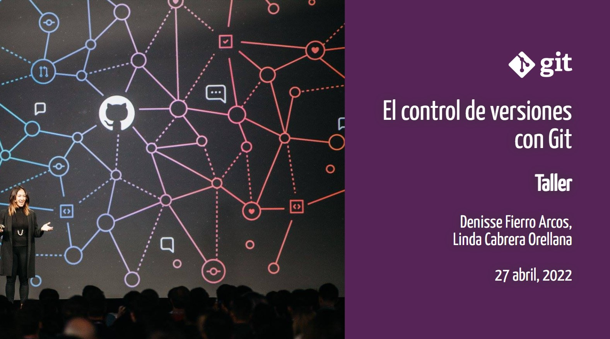
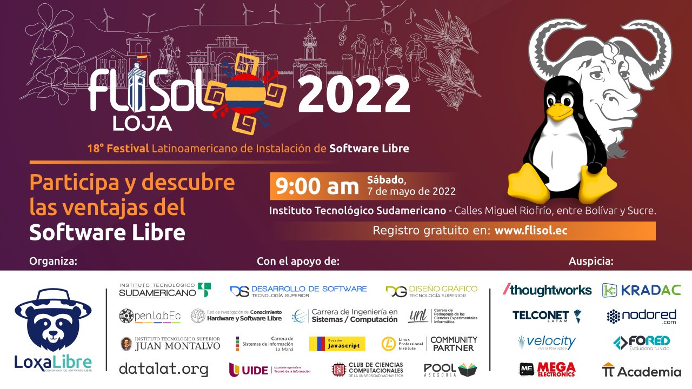
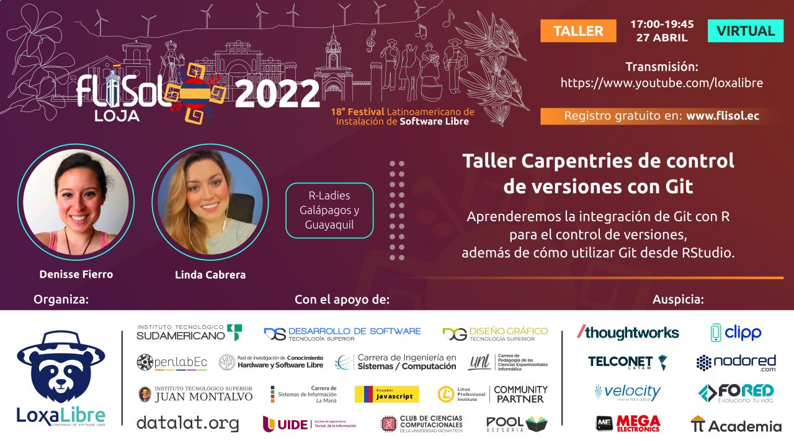
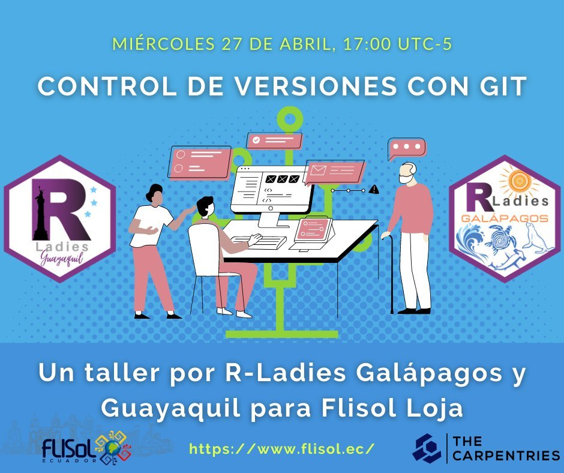
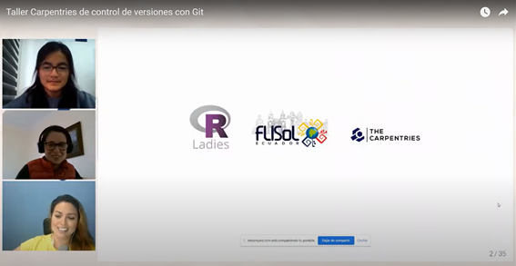

# Control_Versiones_con_GIT

Slides del Taller "Control de Versiones con Git" usando el paquete [xaringan](https://github.com/yihui/xaringan#xaringan) inspirado en el Tema de [RLadies-xalapa](https://spcanelon.github.io/xaringan-rladies-xalapa/index.html), en el marco del 18ª Festival de Software Libre Loja 2022.

Este es el primer Taller de The Carpentries organizado en Ecuador de forma independiente con el apoyo de RLadies Guayaquily RLadies Galápagos

## Temas abordados

* Control Automatizado de Versiones
* Configurando Git
* Creando un repositorio
* Rastreando Cambios
* Explorando el "History"
* Ignorando cosas
* Repositorios remotos en GitHub
* Trabajos en colaboración
* Conflictos
* La ciencia abierta
* Licencia
* Ejemplo de Referencia o cita
* Hospedaje
* Usando Git desde RStudio

## Página del evento: [FLISoL Loja 2022](https://www.flisol.ec/)

## Página del Taller: [Taller Control de versiones con Git](https://lidefi87.github.io/2022-04-26-control-version-Git/)

## Lecciones: [The Carpentries: Control de versiones con Git](https://swcarpentry.github.io/git-novice-es/)

## Taller: [Control de versiones con Git en vivo](https://www.youtube.com/watch?v=zhDGiDqLQxo)

